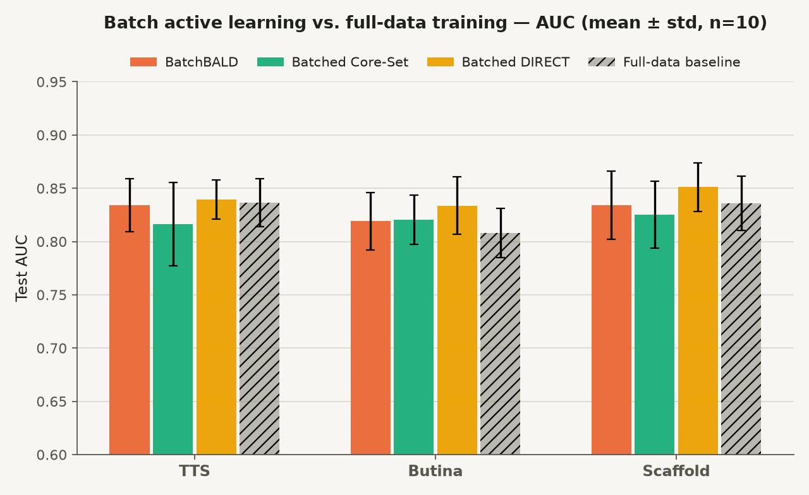
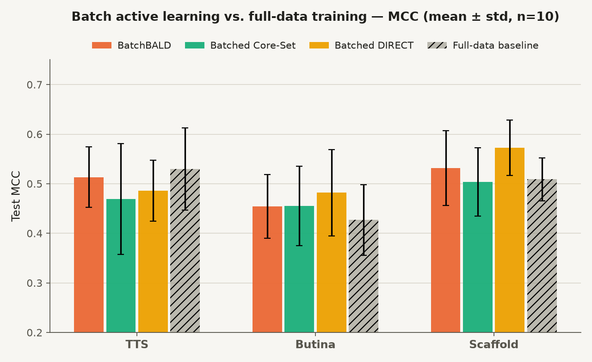

# al_mol_ml: Active-Learning SCAM Classification Pipeline

Benchmarking pipeline for SCAM classification experiments across classical ML, deep learning, and active learning settings.

This repository packages a research workflow for comparing active-learning query strategies and dataset-splitting strategies on SCAM datasets, reproducible via Docker or a local Python environment (see "Running The Pipeline" below).

## Project Summary

The project evaluates whether active learning can identify a more informative training subset than
labeling the full pool, for SCAM classification models. It compares:

- baseline training on the full labeled pool
- active learning with entropy, BALD, Core-Set, and DIRECT query strategies
- multiple dataset variants and train/validation/test split strategies

An earlier version of this project also compared class-imbalance resampling techniques (`SMOTE`,
`ADASYN`, `CondensedNearestNeighbour`, `InstanceHardnessThreshold`); that functionality has since been
removed to keep the codebase focused on the active-learning question above -- see git history if you
need it.

The codebase computes molecular descriptors from SMILES strings, trains several model variants, tracks evaluation metrics across repeated runs, and writes per-study result tables for downstream analysis.

## Repository Layout

```text
.
├── almolml/
│   ├── cli.py               argparse entrypoint
│   ├── pipeline.py          orchestrates one study: split -> train -> score -> write CSVs
│   ├── dataset.py           loads a CSV of (ID, SMILES, label) into featurized (X, Y)
│   ├── featurization.py     SMILES -> descriptor vectors; Butina clustering; scaffold grouping
│   ├── splitters.py         TTS / Butina / scaffold splitters
│   ├── models.py            DeepSCAMs (sklearn MLP), TorchMLPModel, ActiveLearningModel
│   ├── active_learning.py   a small pluggable active learner (no third-party AL library)
│   ├── query_strategies.py  acquisition functions: entropy, BALD (MC-Dropout), Core-Set, DIRECT
│   ├── validation.py        AUC/accuracy/F1/MCC for a model on one (X, Y) set
│   ├── delong.py            DeLong's method for the ROC AUC confidence interval
│   ├── utilities.py         small general-purpose helpers (arg parsing, filesystem setup)
│   └── paths.py             REPO_ROOT
├── Datasets/                input datasets used by the benchmark pipeline
├── Results/                 generated experiment outputs and analysis figures
└── tests/                   pytest suite: one test module per almolml module, plus a full pipeline smoke test
```

## Running The Pipeline

### With Docker (recommended)

```bash
docker build -t almolml .
docker run --rm -v $(pwd)/Results:/app/Results almolml --study_name SF_TTS
```

The `-v` mount persists results on the host; without it, results only exist
inside the container's filesystem. Builds a CPU-only image by default; for
a CUDA image on a machine with a GPU, add `--build-arg TORCH_VARIANT=gpu`.

### With a local Python environment

Requires [`uv`](https://docs.astral.sh/uv/) and Python 3.10+ (`.python-version`
pins 3.11, which `uv` will install automatically if it's missing).

torch ships as two mutually exclusive builds -- pick one when syncing:

```bash
uv sync --extra cpu   # portable, no GPU driver needed
# or
uv sync --extra gpu   # CUDA build; requires a matching NVIDIA driver
```

Then:

```bash
uv run almolml --study_name SF_TTS
```

Optional dataset path override:

```bash
uv run almolml --study_name SF_TTS --datasets_path ./Datasets
```

Useful flags for faster or non-interactive (e.g. CI) runs:

- `--iterations N` -- number of repeated train/evaluate runs (default 10)
- `--epochs N` -- training epochs for the neural network models (default 50)
- `--max_queries N` -- cap on active-learning query rounds per run (default:
  use the full training pool, which is what makes a full study slow)
- `--al_strategy {entropy,bald,core_set,direct,bald_batch,core_set_batch,direct_batch}`
  -- which acquisition function picks the next active-learning query
  (default: entropy; see "Active Learning Query Strategies" below)
- `--batch_size N` -- number of pool points to query and label per round
  (default: 1, the original point-at-a-time loop). Only meaningful with a
  `*_batch` strategy; passing `> 1` with a single-point strategy raises an
  error.
- `--overwrite` -- replace an existing results directory for the study
  without an interactive yes/no prompt
- `--seed N` -- base random seed (default: 0). Iteration `i` of a study is
  seeded with `seed + i`, so each iteration is an independent, reproducible
  draw instead of inheriting whatever RNG state prior calls happened to
  leave behind.

Study names follow the pattern:

```text
<dataset>_<split>
```

Examples:

- `SF_TTS`: `SCAMS_filtered.csv`, train/test split
- `SP1_B`: balanced-positive dataset, Butina split
- `SP2_SS`: augmented-positive dataset, scaffold split

## Method Overview

Pipeline stages:

1. Load dataset and held-out test set from `Datasets/`.
2. Convert SMILES strings into molecular descriptors.
3. Split train and validation sets with the configured strategy.
4. Train non-active-learning models.
5. Train the active-learning model over iterative query rounds.
6. Evaluate on validation and test sets.
7. Save run-level metrics and aggregate study outputs into `Results/`.

Tracked metrics include:

- ROC AUC with confidence interval bounds
- accuracy
- F1
- MCC

## Active Learning Query Strategies

All strategies share the same loop (`almolml/active_learning.py`'s `ActiveLearner`): start from a small
labeled seed set, repeatedly pick unlabeled pool point(s) to query next, label them, retrain the model
from scratch on the accumulated labeled set, and repeat. What differs between them is purely *which
point(s) get picked* -- the acquisition function -- implemented in `almolml/query_strategies.py`. Select
one with `--al_strategy {entropy,bald,core_set,direct,bald_batch,core_set_batch,direct_batch}`.

Entropy, BALD, Core-Set, and DIRECT query **one** point per round. BALD, Core-Set, and DIRECT each also
have a batch variant (`bald_batch`, `core_set_batch`, `direct_batch`) that queries `--batch_size` points
per round and retrains once per batch instead of once per point -- see each strategy's own section below
for why picking a batch isn't just "run the single-point version `batch_size` times": in general the
single highest-scoring points are also the most similar to each other (they're often uncertain/far/near-
the-boundary for the same reason), so naively taking the top-`k` independently tends to select redundant
points instead of a genuinely diverse batch.

### Entropy sampling (`entropy_query`)

Classic uncertainty sampling: run the model's single forward pass over the pool and pick the point
whose predicted class probabilities are closest to uniform (highest Shannon entropy). For binary
classification this is the point closest to `P(class=1) = 0.5` -- the model's single best guess is
least confident there. It uses only the model's current point estimate, with no notion of *why* the
model is unsure (a genuinely ambiguous point and a point the model just hasn't seen enough of yet look
identical to it).

> Lewis, D. D., & Gale, W. A. (1994). *A Sequential Algorithm for Training Text Classifiers*. SIGIR '94.

### BALD (`bald_query`, `bald_scores`)

Bayesian Active Learning by Disagreement, estimated via MC-Dropout. Instead of one forward pass, it
runs `n_mc_samples` stochastic passes with dropout left *on* at inference time, giving a small ensemble
of predictions per pool point. The BALD score is the mutual information between the prediction and the
model's (dropout-approximated) posterior over parameters: `predictive_entropy - expected_entropy`,
i.e. how uncertain the *averaged* prediction is, minus how uncertain each individual pass is on
average. This is high specifically when individual passes are each confident but disagree with each
other (epistemic uncertainty -- the model hasn't learned enough) and low when passes agree even if the
averaged prediction itself is uncertain (aleatoric/data noise) -- the distinction entropy sampling
can't make.

> Gal, Y., Islam, R., & Ghahramani, Z. (2017). *Deep Bayesian Active Learning with Image Data*. ICML
> 2017. (BALD itself originates in Houlsby, N., Huszár, F., Ghahramani, Z., & Lengyel, M. (2011).
> *Bayesian Active Learning for Classification and Preference Learning*. arXiv:1112.5745 -- Gal et al.
> contribute the MC-Dropout approximation used here to make it tractable for neural networks.)

#### Batched: BatchBALD (`batch_bald_query`)

Repeatedly picking the single highest bald_scores point and retraining, `batch_size` times, tends to
pick a batch of near-duplicates: the highest-scoring points are usually uncertain for the *same* reason
(clustered around the same decision boundary, say), so knowing one's label makes the others barely more
informative. BatchBALD instead greedily builds a batch that jointly maximizes mutual information with
the model's posterior, `I(y_1, ..., y_b; theta)`, one point at a time: it still adds the single best point
first, but each subsequent pick accounts for how much *new* information it adds given the points already
in the batch, not just its own individual score. Concretely, conditional on one dropout mask, pool points
are independent, so a batch's expected per-mask entropy is just the sum of each member's own expected
entropy (no extra work over bald_scores); the batch's *joint predictive* entropy isn't similarly
decomposable, though, and requires enumerating the `2**batch_size` joint label configurations of the
candidate batch under each MC sample -- built up incrementally over `batch_size` greedy steps. This makes
the cost exponential in `batch_size`, so it's only practical for modest batch sizes.

> Kirsch, A., van Amersfoort, J., & Gal, Y. (2019). *BatchBALD: Efficient and Diverse Batch Acquisition
> for Deep Bayesian Active Learning*. NeurIPS 2019.

### Core-Set (`core_set_query`, `farthest_point_index`)

Greedy k-center diversity sampling, with no model uncertainty involved at all. Every point (labeled and
pool) is projected into the model's learned embedding space (the penultimate layer, via `_embed`), and
the strategy queries whichever pool point is *farthest* from its nearest already-labeled neighbor --
i.e. whichever region of the input space the current labeled set covers most poorly. The premise: a
model trained on a labeled set that's geometrically well-spread over the data manifold generalizes
better than one trained on an uncertainty-selected set, which can clump around a single decision
boundary and miss whole regions of the space.

> Sener, O., & Savarese, S. (2018). *Active Learning for Convolutional Neural Networks: A Core-Set
> Approach*. ICLR 2018.

#### Batched: Core-Set (`batch_core_set_query`)

Unlike the other three strategies, Core-Set's own paper is already framed as a batch method (its
Algorithm 1), so this isn't really an adaptation -- `core_set_query` above is just one greedy step of it.
`batch_core_set_query` repeats that step `batch_size` times, adding each pick's embedding to the
reference set *before* choosing the next: the first pick is the point farthest from the labeled set, the
second is the point farthest from the labeled set *plus that first pick*, and so on. This matters because
the single farthest point and the second-farthest point are frequently neighbors in embedding space (both
sit in the same poorly-covered region) -- taking the top-`batch_size` distances from the original labeled
set alone, without this update step, would tend to pick a cluster of near-duplicates from that one region
rather than spreading across several. Does not implement the paper's optional outlier-robustness
refinement (their Algorithm 2, a mixed-integer program), just the core greedy batch procedure.

### DIRECT (`direct_query`, `separation_threshold`)

Reduces active learning to a 1-D separation-threshold problem, aimed at class-imbalanced pools. From
the currently labeled set, `separation_threshold` finds the score value (predicted `P(minority class)`)
that best splits labeled points into majority/minority by minimizing balanced misclassification count;
`direct_query` then queries the pool point whose predicted `P(minority)` is closest to that threshold --
i.e. the point nearest the model's current best guess at the decision boundary. Falls back to entropy
sampling if the labeled set doesn't yet contain both classes (the threshold is undefined).

This is an adaptation, not a full implementation: the original paper's DIRECT is a multi-round batch
algorithm whose VReduce subroutine spends part of each round's budget *narrowing* a candidate threshold
interval before annotating near it, refining the estimate over several rounds within one query batch.
`direct_query` queries one point at a time and re-estimates the threshold from scratch on every single
call -- a much weaker, single-shot version of the same core idea, since the threshold estimate here never
accumulates the benefit of that iterative narrowing.

> Zhang, S., Katz-Samuels, J., & Nowak, R. (2025). *Improved Algorithms for Deep Active Learning under
> Imbalance via Optimal Separation*. ICML 2025. arXiv:2312.09196.

#### Batched: DIRECT (`batch_direct_query`)

Still not literal VReduce (see above -- that would need restructuring `ActiveLearner`'s single-point
query/teach loop into an actual batch acquisition loop with its own internal rounds, which hasn't been
attempted here), but a better-justified batch than "run `direct_query` `batch_size` times": rather than
always taking the single nearest point to the current threshold estimate, it alternates nearest-below,
nearest-above, next-nearest-below, next-nearest-above, and so on -- straddling the threshold from both
sides. One round of labels can then confirm or correct the threshold's location from both directions at
once, instead of nudging it a single point at a time in whichever direction happened to be nearest. Falls
back to the `batch_size` highest-entropy pool points if the labeled set doesn't yet contain both classes.

(Margin sampling, another common baseline, was considered and skipped: for binary classification it
ranks samples identically to entropy sampling, so it wouldn't add a distinct comparison point.)

## Results: Does Batch Active Learning Beat Full-Data Training?

The comparison that matters: does a batch strategy's final model (trained on the labels *it* chose to
query) do any better than a model trained on the entire labeled pool? Each of the three batch strategies
was run on all three splits (TTS, Butina, Scaffold), **10 independent iterations each** (fresh initial
sample and model init every time) -- a real variance estimate, not a single noisy run.





**No strategy on any split beats the full-data baseline by more than run-to-run noise.** Every bar's
error bar overlaps the baseline's own error bar in both charts, for all nine (strategy, split)
combinations. Batched DIRECT is directionally the strongest performer -- highest mean AUC and MCC on
TTS and Butina, though not Scaffold -- but its own std is wide enough that this isn't distinguishable
from chance with 10 iterations.

This is a materially different conclusion than any single run in this project suggested along the way:
an earlier single-run full-pool comparison had Core-Set apparently beating the baseline (0.852 vs.
0.834 AUC), and an earlier single-run batch comparison had batched DIRECT apparently beating baseline by
0.09 AUC on TTS. Both of those gaps disappeared once actually repeated. The practical lesson generalizes
beyond this dataset: **a single active-learning run "beating" full-data training is not evidence of a
real effect** -- the full-data baseline itself varies run to run by about as much as any of the observed
"wins," so the only way to tell a real effect from noise is to repeat the comparison.
